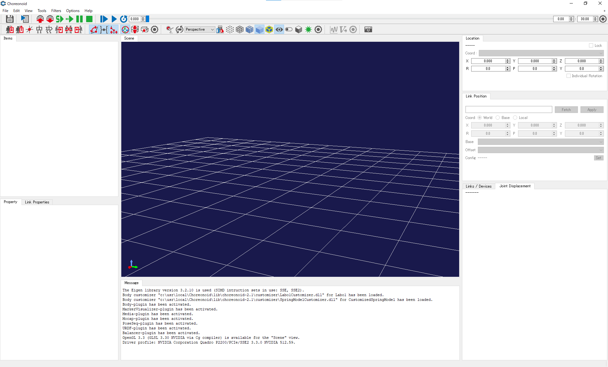

## Instruction for using choreography function of Choreonoid

The following instruction is based on a video lecture by Shin-ichiro Nakaoka.

### Preparation

Build Chorenoid from source.
In CMake, turn on the following options:
- BUILD_POSE_SEQ_PLUGIN=ON
- BUILD_BALANCER_PLUGIN=ON
- BUILD_MOCAP_PLUGIN=ON
- BUILD_HRP4C_HANDLER=ON
- BUILD_MEDIA_PLUGIN=ON

### Step by step instruction of choreography

- Start up Choreonoid.

- Next

