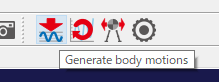

## Instruction for using choreography function of Choreonoid

The following instruction is based on a lecture provided by Shin-ichiro Nakaoka in [HVAC2023 Technical Tutorial](https://ytazz.github.io/vnoid/hvac2023tutorial.html).

### Preparation

Build Chorenoid from source.
Version 2.0.0 or later is required.
In CMake, turn on the following options:
- BUILD_POSE_SEQ_PLUGIN=ON
- BUILD_BALANCER_PLUGIN=ON
- BUILD_MOCAP_PLUGIN=ON
- BUILD_HRP4C_HANDLER=ON
- BUILD_MEDIA_PLUGIN=ON

The command-line should look like:
```
cmake . -DBUILD_POSE_SEQ_PLUGIN=ON -DBUILD_BALANCER_PLUGIN=ON -DBUILD_MOCAP_PLUGIN=ON -DBUILD_HRP4C_HANDLER=ON -DBUILD_MEDIA_PLUGIN=ON 
```

The BUILD_HRP4C_HANDLER option is needed if you want to use custom IK for the HRP-4C model.

### Step by step instruction of choreography

- Start up Choreonoid.


Check the message view to see if required plug-ins are properly loaded.

- Create a world

Add a world item (File -> New -> World).


- Load robot model

Select World in the item view, and select File -> Load -> Body.
In the load dialog, navigate to the source directory of choreonoid and select choreonoid/share/model/HRP4C/HRP4C.body.


In the item view, make sure that HRP-4C is listed below World as its child item.

You can switch between the "edit mode" and the "view mode" by right-clicking on the scene view.
In the "edit mode", you can select a link of the robot, and change its pose by dragging the 3D cursor.


- Load floor

Select World in the item view, and select File -> Load -> Body.
In the load dialog, navigate to the source directory of choreonoid and select choreonoid/share/model/misc/floor.body.


To avoid selecting and moving the floor accidentally, it is recommended to fix the floor.
To do so, switch to the edit mode, right-click the floor and select "Lock location".

Floor is necessary for computing physical interaction between the robot and the floor.
However, while editing the motion of the robot, it is often convenient if the floor is not shown.
To hide the floor, uncheck the checkbox of Floor in the item view.

- Add PoseSeq item

Select HRP-4C in the item view, and select File->New->PoseSeq.
Make sure that the created PoseSeq item is shown below HRP-4C in the item view.

Select View->Show View->Pose Roll and show the Pose Roll view.
This view is used for choreography.
Select PoseSeq in the item view.
Now, the name of the PoseSeq item ("PoseSeq" in this case) will be shown in the bottom left of the pose roll view.

Up to this point is basic preparation for pose editing.
Save the project by selecting File->Save Project As.
The project and pose sequence will be saved to separate files (.cnoid file and .pseq file respectively).


- Adjust window layout for pose editing

You can grab the tab of each view and drag it to change the layout of views according to your needs.
In pose editing, Pose Roll view and Joint Displacement view are often used, so these views
 would better be shown bigger.
Moreover in the Joint Displacement view, you can show joint names in addition to joint IDs by
 right-clicking its tab and checking "Joint name".
Shown below is an example layout.


- Edit initial pose

To start simulation in a stable manner, the feet of the robot should be just touching the floor.

First, enable collision cheking.
To do so, select World item, and in the property view just below the item view,
 switch "Collision detection" property to True.

Next, enable visualization of collision.
To do so, check the check box of World item.
Moreover, push the button shown below in the tool bar.


Now, reset the pose of the robot.
There are some buttons for reseting the pose of the robot.


The initial pose is the pose where all joint angles are zero,
 while the standard pose is a more useful starting configuration with knees bent slightly.
Here, reset to the standard pose.

Now, we would like to adjust the height of the robot so that its feet are just touching the floor.
For this purpose, we need use FK instead of IK.
To do this, turn on the "Enable forward kinematics" button and 
 turn off "Use preset kinematics" and "Enable inverse kinematics" buttons, as shown below.


Then you should be able to drag the WAIST link (highlighted yellow in the figure below)
 to move the robot without chaninging its posture.

*If this doesn't work, try switching to view mode and back to edit mode.


 
As you move the robot gradually down, eventually the feet will start to penetrate into the floor,
 and green lines indicating collision will appear, and grow longer as the penetration gets deeper.
Stop lowering the robot when these green lines have just started to show up.

Alternatively, you can change the position of the selected in in the Link Position view.
This way is more useful for precise positioning.

In the case of HRP-4C, the ideal z coordinate of the base link in the standard posture is 0.719m.

- Insert initial pose to pose sequence

Make sure that the robot is in a proper initial pose as described above.
Now, left-drag in the Pose Roll view and bring the seek bar (black vertical line) to the left most (time 0.0) and click "Insert".
Then the currently edited pose will be inserted as the first key pose of the pose sequence.


- Insert other key poses

You can create new key poses in the same manner;
 edit a new pose in the Scene view, and then in the Pose Roll view, position the seek bar, and push Insert.
After inserting some key poses, it will look like this:


You can left-drag the vertical line indicating each key pose to adjust its timing.
You can also enter the timing directly to the box labeled "T".

The saw-tooth-like lines indicate how motion is interpolated between key poses.
You can left-drag the left end of each saw-tooth (make sure the cursor changes to double-headed arrow)
 to adjust the transition time (TT) of interpolation.
You can also directly enter numerical values to the box labeled "TT".
Entering 0 to "TT" means maximum transition time.


- Updating an existing key pose

Check the PoseSeq item in the item view.
Click the key pose you want to edit in the Pose Roll view.
When selected, it will turn red, and the pose will be shown in the Scene view.
Edit the pose in the Scene view (use edit mode).
When finished, push "Update" button in the Pose Roll view.

- Replicating an existing key pose

Click the key pose you want to replicate.
Uncheck the "Sync" check box in the Pose Roll view.
This disables synchronization between the Pose Roll view and the Scene view.
Position the seek bar to the time you want to copy the pose to, then push "Insert".

- Creating a mirror-copy of a pose

Sometimes you would like to create a mirror-copy of an existing pose.
To do so, first, right-click some link and select "Set Base" (the default is WAIST).
This link will be the fixed link of mirroring.
Next, push the "Mirror copy" button in the tool bar.


An example pose before and after mirroring with respect to left foot.


- Play motion as animation

You might have noticed that by dragging the seek bar left and right, the key poses are smoothly interpolated and shown in the Scene view.
You can also use "Start playback" button to play animation.


To see if the edited motion is physically valid, you can show a marker indicating the position of the projected center-of-mass.
Right-click any link in the Scene view, select Markers->Center of Mass Projection.
If this marker is always inside the support region, the motion is stable provided that the robot moves slow enough.

- Generate dynamically feasible motion

In the item view, expand the PoseSeq item and show the BodyMotionItem.
In the menu bar, select View->Show Toolbar->BodyMotionGenerationBar.
Turn on the "Enable the balancer" button.


By pushing the config button on the right, you can show the config dialog shown below.
Here you can set various configuration parameters of the balancer.


Select either the PoseSeq item or the BodyMotion item in the item view and push "Generation body motions" button.
This will automatically generate dynamically feasible motion by filtering the pose sequence through the balancer.



- Play motion in physics simulation

Select World in the item view, and in the menu bar, select File->New->AIST Simulator.
The simulator item is responsible of performing main computation of physics simulation.

Next, select HRP-4C in the item view, and in the menu bar, select File->New->BodyMotionController.
Furthermore, drag the PoseSeq item and drop it to the BodyMotionController.
Now the item view should look something like this:


The BodyMotionController item is a built-in controller that controls the robot based the BodyMotion item.

Now you can run simulation by pushing the "Start simulation from the beginning" button shown below.


To see the effect of the balancer, turn off the balancer (turn off the "Enable the balancer" button) and run simulation. 
In this case, interpolated pose sequence will be directly input to the robot.
If the original pose sequence includes fast movement, the resulting motion might be unstable (e.g., a foot might lift off the ground),
 or in the worst case the robot might fall down.

Next, turn on the balancer and run simulation again.
This time, the motion of the robot will look more stable.

