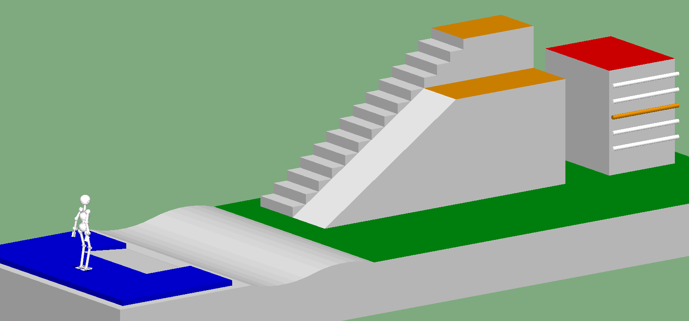
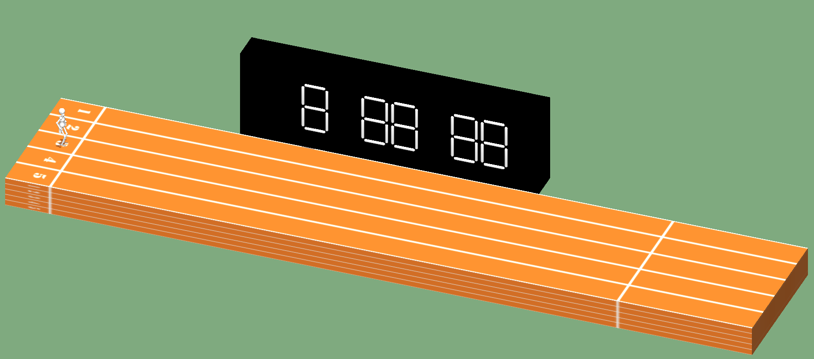
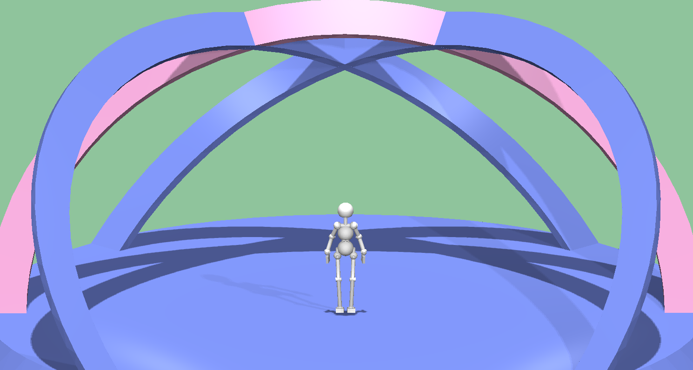

<!--

-->

# Challenge 2022

Under construction. Information is tentative.

## Aim of this challenge

The aim of this challenge is to provide students and researchers in the humanoid robotics research community
 with a common development platform and an opportunity for competition and
 thereby facilitate cutting-edge research in this field
 through the sharing of knowledge, ideas, and technical resources.

Compared to several simulation-based humanoid robot competitions held in the past (e.g., JVRC, DRC, WRS, Robocup),
 the major uniqueness of this challenge is that it focuses of the potential ability of humanoid robots to perform acrobatic movements.

## How to participate

- This challenge takes place based on participants' submissions of simulation log data.
- If you would like to participate in the challenge, please submit application information
  from the link shown below not later than the application deadline.
- After application, you will receive a link for uploading simulation log data.
- After that, you can submit simulation log data at any time during the period of challenge.
  Submitted data will be checked by the steering committee if it conforms with the regulation,
   and if qualified, will appear in the list of qualified submissions shown in this webpage.

## Important Dates of 2022

- Website opening: mid July
- Application deadline: August 31st.
- Challenge period: mid July to mid November

## Application form

<!--
Now being prepared.
-->
[Here](https://docs.google.com/forms/d/e/1FAIpQLSdFkUbLTEVpoHGqvfrTeW59-84Kaf-RCNaI9FLpQUu1h0EpCQ/viewform?usp=sf_link)

## Challenge Themes

### Athletics

The robot traverses the athletic field from the starting position to the goal.
Performance is evaluated by reached landmark and elapsed simulation time.

### Short track

The robot walks/runs the 20[m] short track.
Performance is evaluated by elapsed simluation time while the robot passes the start line and the goal line.

- [Results](https://ytazz.github.io/vnoid/results_shorttrack2022.html)

### Free-style performance

The robot performs something extraordinary.
How to evaluate the quality of free-tyle performance is T.B.D.

## Regulation

### Detailed regulation

Please see the following document for detailed regulations.
Regulations are tentative and subject to change.
- [English version](https://docs.google.com/document/d/1IByD9HIQXkZe2DvtmmWsXEv41ggnn6dhuJRX_RMjAMU/edit?usp=sharing)
- [Japanese version](https://docs.google.com/document/d/1ogiDxNIxWfxW_FQZx8znWPebEcD6XJPvIECpy_ovViE/edit?usp=sharing)

### Regulations overview

[Choreonoid](choreonoid.org) is used for the simulation environment of this challenge.
Each team designs a robot model and a controller that can be loaded and run on Choreonoid.

#### Creating a robot model

- The model is recommended to be written in the .body format.
- The number of joints must not exceed 50.
- The type of joints may be revolute or prismatic.
- The total mass of the robot must be 40[kg] at the minimum.
- The robot in its initial posture must be inside the box of X x Y x Z = 70cm x 70cm x 200cm.

#### Implementing a controller

- The controller should basically be implemented as a SimpleController of Choreonoid.
- The main controller could be implemented using some other framework such as ROS,
  and exchange information between Choreonoid over a communication bridge.

#### Actuation
- The actuation mode of each joint may be either Velocity or Torque.
  Torque mode is recommended for stable simulation.
- Only joints can be directly actuated.
  Directly actuating the links (the rigid bodes) is not permitted (use it for test purpose only).
  
#### Sensing
- Various sensor nodes supported by Choreonoid such as ForceSensor, RateGyroSensor, AccelerationSensor, and RangeSensor, may be used.
  The number of sensors is not limited.
- The position and velocity of joints can be retrieved through the SimpleControllerIO interface.
- Retrieving the absolute position and orientation of links (rigid bodies) is also permitted
  (there is no need for position/posture estimation).

#### Simulator setting
- The AISTsimulator physics engine for simulation.
  Switching to other physics engines. or changing the parameters of the AISTsimulator is not permitted.
- A sample .cnoid project file is provided for each challenge theme.
  Use the simulator setting described in this file for simulation.

#### Operating the robot
- The robot can be operated with an input device, typically a joystick.
- The operator can operate the robot while monitoring the robot on the 3D view of Choreonoid.

## Quick Start
- See [here](https://ytazz.github.io/vnoid/build_sample_2022.html) for how to build and run the sample.

## Asking Questions
- Post your question at [https://github.com/ytazz/vnoid/discussions](https://github.com/ytazz/vnoid/discussions)

## Old pages
- [Challenge 2021 page](https://ytazz.github.io/vnoid/index2021.html)
