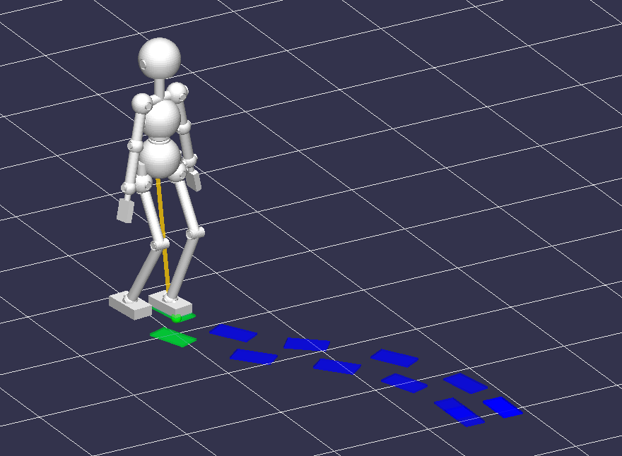
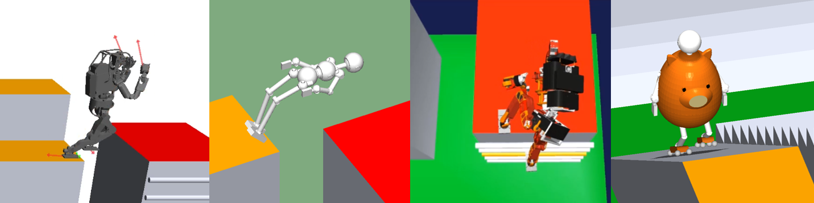
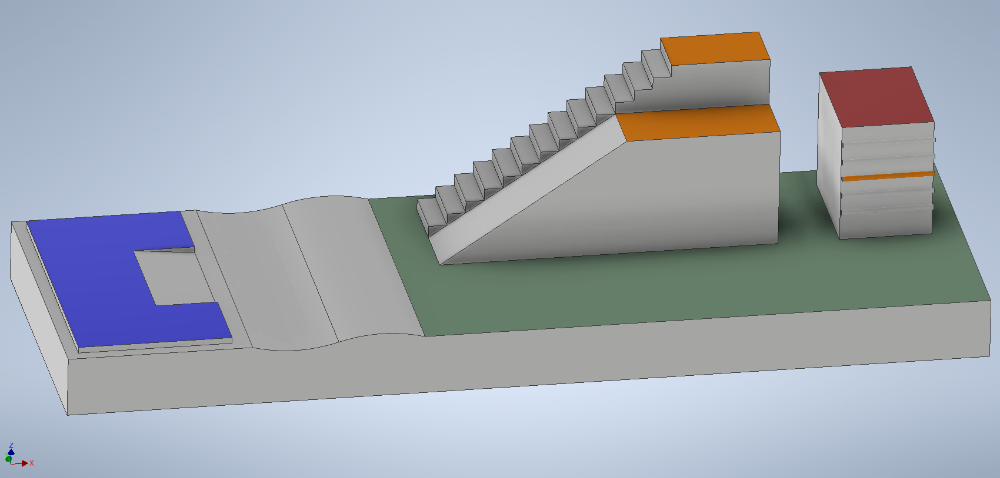

<!--

-->

## Aim of this challenge

The aim of this challenge is to provide students and researchers in the humanoid robotics research community
 with a common development platform and an opportunity for competition and
 thereby facilitate cutting-edge research in this field
 through the sharing of knowledge, ideas, and technical resources.

Compared to several simulation-based humanoid robot competitions held in the past (e.g., JVRC, DRC, WRS, Robocup),
 the major uniqueness of this challenge is that it focuses of the potential ability of humanoid robots to perform acrobatic movements.

## Important Dates

- Website opening: early October 2021
- Application deadline: **15 November 2021**  still open for later application
- Preliminary challenge: **25 December 2021**, online, finished.
- Main challenge: **12 March 2022**, online, finished. Many thanks for attending!

### Challenge Results

Log data, video, and presentation materials will be uploaded soon.
Log data can be opened on Choreonoid (development version) and the simulation can be replayed on your PC.

|  Team name        |  Robot name | Reached Checkpoint | Simulation Time | Realtime-factor | Links | Remark |
| ----              | ----        | ----               | ----            | ----            | ----  | ----   |
| FisMa	            |             | Blue               |                 | 1.0028          | [slides](https://drive.google.com/file/d/1LQclVjHiRO92mFu375azhxUZ1ldTp2lh/view?usp=sharing)   [log](https://drive.google.com/file/d/1HS2Db6hW-MsMXF2iLAMwoXcOXi1dE3HT/view?usp=sharing)      |        |
| IRL-Meiji	        | Meiped-HVAC | Blue               |                 | 1.0000          | [slides](https://drive.google.com/file/d/1I7LMPIfDUpaGNXRAfyksNxGXzJ8qQKcp/view?usp=sharing)   [log](https://drive.google.com/file/d/1vRJoS5daS3EGJletM248c_m90PzaIW1C/view?usp=sharing)   [video](https://drive.google.com/file/d/1BRAAFbS7PDz-Zvv7Y0jauWS5MB9QR_QK/view?usp=sharing)     |        |
| AIST-JRL-MM       | HRP-5P      | Red                | 129.324         | 1.5586          | [slides](https://drive.google.com/file/d/1JXMHQoOkRj0YW3g4sy1IIKsAg4c1UVuP/view?usp=sharing)   [video](https://drive.google.com/file/d/1jP5NVx3h8Ve3DX90CJLhUdsz7ng8M9h_/view?usp=sharing)      |        |
| Solver	        |             | Orange*            |                 |                 |       | Started from Green area |
| 水内研究室仮配属  | minimum man | Green              |                 | 1.00078         | [slides](https://drive.google.com/file/d/10-31CTZPaWFn2ohFl7nEk7OAqVKGjYRg/view?usp=sharing)   [log](https://drive.google.com/file/d/1zvlJKVtGOZs-cjCvDWr2C9iLHDmtubp2/view?usp=sharing)   [video](https://drive.google.com/file/d/1TnD4TB7rtbTy4HDwaKA3FFkMtxc3Ax2O/view?usp=sharing)      |        |
| 水内研究室仮配属1 | First Gear  | Red                | 224.737         | 1.6970          | [slides](https://drive.google.com/file/d/1UVrTeZQBUOETP1twkflKJqIFxuCCdUNh/view?usp=sharing)   [log](https://drive.google.com/file/d/1n0eX9GC8WT-uL4EL7OZsLWJgTgf7olFL/view?usp=sharing)   [video](https://drive.google.com/file/d/1pbjMReUD163BM6DUuL2_tlyQNEWOZFDw/view?usp=sharing)     |        |
| MA1               | Uriborg Mk1 | Red                | 104.529         | 1.4298          | [slides](https://drive.google.com/file/d/1AumTRIRqJkpo2p3qCCXyiSZ18NaMXQFA/view?usp=sharing)   [log](https://drive.google.com/file/d/15ap6TAAxZ167Gtpg5pVj2n9EIu1VYVao/view?usp=sharing)   [video](https://drive.google.com/file/d/1cXwt5ZiVwJWZqRoV9rAoZnrOKCJhOTxU/view?usp=sharing)     |        |
| Legendless  	    |             | Red*               |                 |                 | [slides](https://drive.google.com/file/d/1Id0sNaff4Jir__VoHBTM66eqd0Sjswj_/view?usp=sharing)   [video](https://drive.google.com/file/d/1wRUm-Bed5oJzsy2XyzJSTttKrfIXcQ17/view?usp=sharing)      | Used own simulator |
| Team Jaxon        | Jaxon       | Red                | 135.348         | 1.30028         | [log](https://drive.google.com/file/d/1QikZcG_u_6faHn1pj-RhfqBb3d6ogwIa/view?usp=sharing)   [video](https://drive.google.com/file/d/1SK09fC3H-_Hl87ZEojlEcsuwXV64MTFG/view?usp=sharing)   [video (ladder)](https://drive.google.com/file/d/1DN01mFGuJruH5QhGEmNrIAxDku3vr7u9/view?usp=sharing)      |        |

<!--
Listed in the order of application.
Results of preliminary challenge are listed (Dec 28, 2021).

|  Team name        |  Robot name | Reached Landmark  | Simulation Time | Realtime-factor |
| ----              | ----        | ----              | ----            | ----            |
| MA1               | Uriborg Mk1 | Green             | 0:25            | 1.15            |
| ssr-act           |             |                   |                 |                 |
| FisMa	            |             |                   |                 |                 |
| Legendless  	    |             | Orange (Top stair)| 3:21            |                 |
| solver	        |             | Blue              |                 |                 |
| 水内研究室仮配属1 | First Gear  | Green             | 0:55            | 2.29            |
| IRL-Meiji	        | Meiped-HVAC |                   |                 |                 |
| 落合重工          |             |                   |                 |                 |
| prime4294967279	|             | Green             | 0:09            | 1.17            |
| Team Jaxon        | Jaxon       | Red (Goal)        | 2:32            | 1.48            |
| 水内研究室仮配属  | minimum man | Blue              |                 | 1.00            |
-->

## Challenge Theme

The goal of the challenge is to make the robot traverse the athletic field shown in the figure below
 from the starting position to the goal, either by teleoperation, automatic control, or combination of both.

## Regulation

See [here](https://drive.google.com/file/d/1gUBYM62HW0czXO8-PiJqJn6ycbd-Wtij/view?usp=sharing)
for detailed regulation (Japanese only).

[Choreonoid](choreonoid.org) is used for the simulation environment of this challenge.
Each team designs a robot model and a controller that can be loaded and run on Choreonoid.

### Creating a robot model

- The model is recommended to be written in the .body format.
- The number of joints must not exceed 50.
- The type of joints may be revolute or prismatic.
- The total mass of the robot must be 40[kg] at the minimum.
- At the initial posture, the robot must be inside the box of X x Y x Z = 70cm x 70cm x 200cm.

### Implementing a controller

- The controller should be implemented as a SimpleController of Choreonoid.
- The main controller could be implemented using some other framework such as ROS,
  and exchange information between Choreonoid over a communication bridge.

#### Actuation
- The actuation mode of each joint may be either Velocity or Torque.
  Torque mode is recommended for stable simulation.
- Only joints can be directly actuated.
  Directly actuating the links (the rigid bodes) is not permitted in the trial (use it for test purpose only).
  
#### Sensing
- Various sensor nodes supported by Choreonoid such as ForceSensor, RateGyroSensor, AccelerationSensor, and RangeSensor, may be used.
  The number of sensors is not limited.
- The position and velocity of joints can be retrieved through the SimpleControllerIO interface.
- Retrieving the absolute position and orientation of links (rigid bodies) is also permitted
  (there is no need for position/posture estimation).

### Simulator setting
- The AISTsimulator physics engine for simulation.
- Switching to other physics engines. or changing the parameters of the AISTsimulator is not permitted in the trial.
- A sample .cnoid project file is provided.
  Use the simulator setting described in this file for the trial.

### Operating the robot
- The robot can be operated with an input device, typically a joystick.
- The operator can operate the robot while monitoring the robot on the 3D view of Choreonoid.

### Evaluation
The quality of the trial is evaluated based on the following criteria:

#### Goal reaching
- The goal and several intermediate checkpoints are specified in the field. They are shown in different colors.
  Whether the robot could reach each checkpoint during the trial is recorded.
  
#### Speed
- Simulation time elapsed before reaching the each checkpoint is recorded.
  
#### Realtime-ness
- The ratio of simulation-time and computation-time is recorded to evaluate how much the controller violates the realtime constraint.

## Quick Start
- See [here](https://ytazz.github.io/vnoid/build_sample.html) for how to build and run the sample.

## How to Apply
- Fill in and send your application information from [Google Forms](https://docs.google.com/forms/d/e/1FAIpQLSfSJpFjd2HKMdh3X6ul73qPH_Yzn0-rUjdUMSX40r42tThosQ/viewform?usp=sf_link)

## Asking Questions
- Post your question at [https://github.com/ytazz/vnoid/discussions](https://github.com/ytazz/vnoid/discussions)

