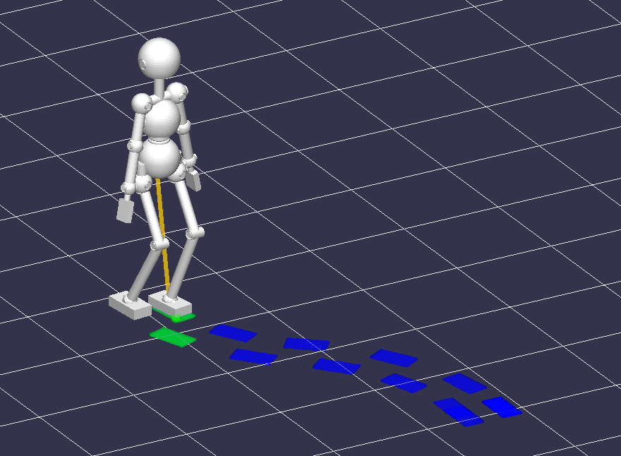
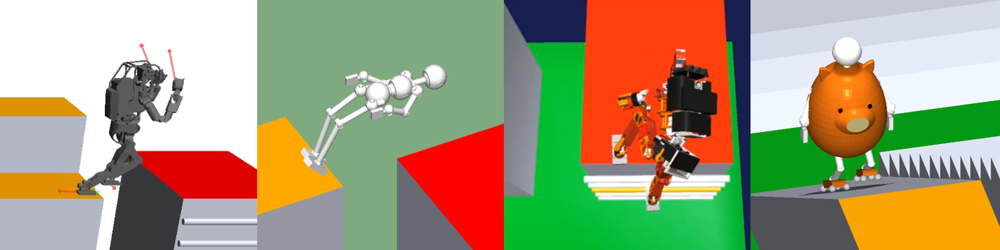
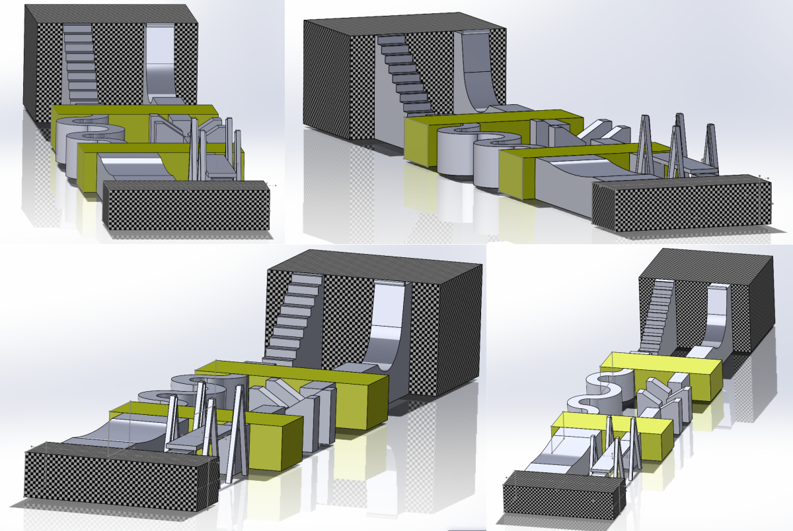
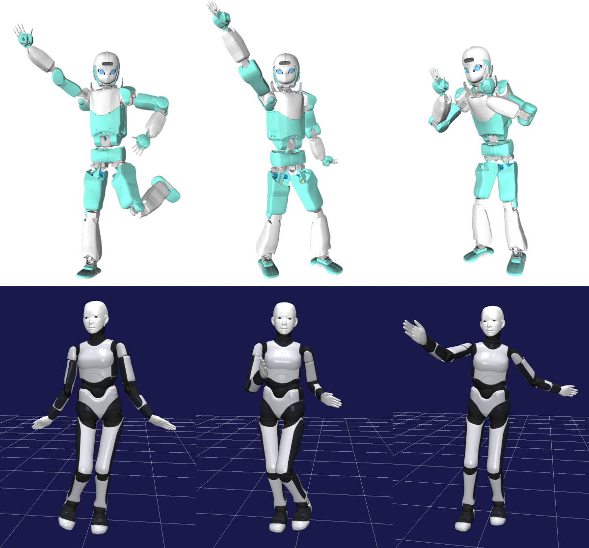
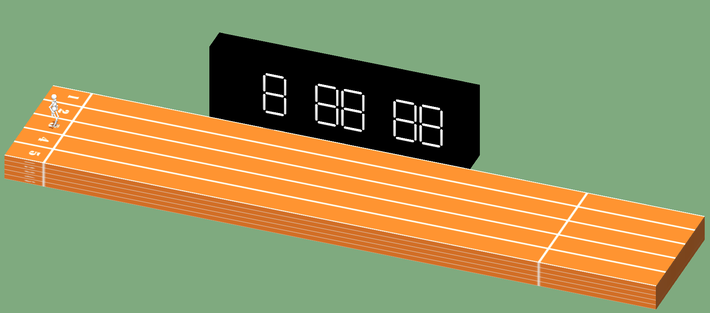
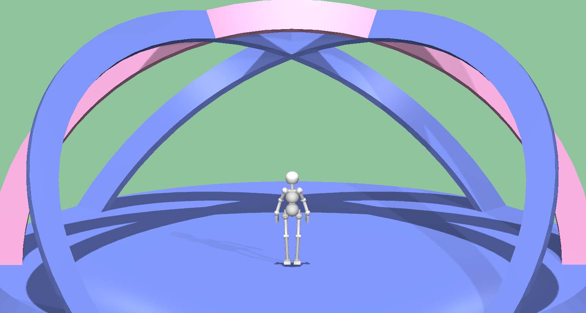

<!--

-->

<iframe width="355" height="200" src="https://www.youtube.com/embed/2xOmlHx2b4U" title="YouTube video player" frameborder="0" allow="accelerometer; autoplay; clipboard-write; encrypted-media; gyroscope; picture-in-picture" allowfullscreen></iframe>
<iframe width="355" height="200" src="https://www.youtube.com/embed/BR4rxW9pEog" title="YouTube video player" frameborder="0" allow="accelerometer; autoplay; clipboard-write; encrypted-media; gyroscope; picture-in-picture" allowfullscreen></iframe>

# 速報
[Humanoid Virtual Athletics Challenge 2026 春ミーティング](https://ytazz.github.io/vnoid/hvac2026tutorial.html)
を開催します．ふるってご参加ください！

# Challenge 2025

## Aim of this challenge

The aim of this challenge is to provide students and researchers in the humanoid robotics research community
 with a common development platform and an opportunity for competition and
 thereby facilitate cutting-edge research in this field
 through the sharing of knowledge, ideas, and technical resources.

Compared to several simulation-based humanoid robot competitions held in the past (e.g., JVRC, DRC, WRS, Robocup),
 the major uniqueness of this challenge is that it focuses of the potential ability of humanoid robots to perform acrobatic movements.

## How to participate

- This challenge takes place based on participants' submissions of simulation log data.
- If you would like to participate in the challenge, please submit application information
  from the link shown below not later than the application deadline.
- After application, you will receive a link for uploading simulation log data.
- After that, you can submit simulation log data at any time during the period of challenge.
  Submitted data will be checked by the steering committee if it conforms with the regulation,
   and if qualified, will appear in the list of qualified submissions shown in this webpage.

## Important Dates of 2025

- Main Challenge: September 2nd, 2025, to be held as part of RSJ2025 open forum

## Application form

<!--
Now being prepared.
-->
[Here](https://docs.google.com/forms/d/e/1FAIpQLSfz-wzvdUys3-AzFTey0XGcP8soD5MrYrmWW7PucJQvofh52g/viewform?usp=header)

<!-- 2024
-[Here](https://docs.google.com/forms/d/e/1FAIpQLSeSxN4F3w2ti-YF4cTTZDEJ5RKPWCEj6dz1IP9A7a-SFMxnDw/viewform?usp=sf_link)
-->

<!-- 2023
-[Here](https://docs.google.com/forms/d/e/1FAIpQLScJD0zL3r_wv2M09Hj_TMIfLwAr0-pc8-OSdCSNlDXvBhAdZg/viewform?usp=sf_link)
-->

<!-- 2022
[Here](https://docs.google.com/forms/d/e/1FAIpQLSdFkUbLTEVpoHGqvfrTeW59-84Kaf-RCNaI9FLpQUu1h0EpCQ/viewform?usp=sf_link)
-->

## Challenge Themes

### Athletics

The robot traverses the athletic field from the starting position to the goal.
Performance is evaluated by reached landmark and elapsed simulation time.

<!--

-->

### Dance

The robot performs dancing that requires whole-body motion.
Dance performance is evaluated in terms of both artistic quality and technical quality.

<!--

-->

### Short track

The robot walks/runs the 20[m] short track.
Performance is evaluated by elapsed simluation time while the robot passes the start line and the goal line.

<!--

-->

<!--
### Free-style performance

The robot performs something extraordinary.
How to evaluate the quality of free-tyle performance is T.B.D.

-->

## Results
- [Athletics](https://ytazz.github.io/vnoid/results_athletics.html)
- [Dance](https://ytazz.github.io/vnoid/results_dance.html)
- [Short Track](https://ytazz.github.io/vnoid/results_shorttrack.html)

## Regulation

### Detailed regulation

Please see the following document for detailed regulations.
Regulations are tentative and subject to change.
- [Common Regulations](https://docs.google.com/document/d/1kAm1k5oPyKb33LVS0LAicwtTlaYHC0enVlFOXf_ZWyQ/edit?usp=sharing)
- [Athletics Regulations](https://docs.google.com/document/d/1LARnyLCjxck-cRduF6dJLifQg5M_5zpTwdWyLSAJarE/edit?usp=sharing)
- [Dance Regulations](https://docs.google.com/document/d/143gkNKohEuArgTGu0W-GL4cQ79Kp_T-_xPucLci7m3Q/edit?usp=sharing)
- [Shorttrack Regulations](https://docs.google.com/document/d/1MkYWEnjo5WNI6O-yg-mjSHCDkwj9Vm66ApA6FYd6Smg/edit?usp=sharing)
- [共通レギュレーション](https://docs.google.com/document/d/127nbNGyn7i5wAJN6fSdnusZHysUt-EOQWXtJ98mQNUg/edit?usp=sharing)
- [アスレチック](https://docs.google.com/document/d/1dUoI85JZOCa4HwlCR69B3BPOtK7mePxPpXyoyQ3NTJE/edit?usp=sharing)
- [ダンス](https://docs.google.com/document/d/1r-5InTuQfFtnyoDuQXTPSiz_znt4Sfqtb134VcWe_UE/edit?usp=sharing)
- [短距離](https://docs.google.com/document/d/1KWvlnkfcPWF-rG0sGCemXgtJ0elBgrXffiB8zoZwZZw/edit?usp=sharing)

## Quick Start
<!--
- See [here](https://ytazz.github.io/vnoid/build_sample_2022.html) for how to build and run the sample.
-->
- See README of [vnoid](https://github.com/ytazz/vnoid) for quick instructions.

## Committee

- HVAC2025 is hosted by the Special Interest Group on Humanoid Robotics of the Robotics Society of Japan (RSJ-SIG-HR).
- HVAC2025 is run by volunteers consisting of members and non-members of RSJ-SIG-HR.
  - Commitee members
    - Yuichi Tazaki	(Kobe Univ.)
	- Takumi Kamioka (OMRON Corp.)
	- Tomomichi Sugihara (OMRON Corp.)
	- Masaki Murooka (AIST)
	- Kenji Hashimoto (Waseda Univ.)
	- Ikuo Mizuuchi (TUAT)
	- Yohei Kakiuchi (TUT)
	- Shin’ichiro Nakaoka (Choreonoid)
	- Soh Yukizaki (KHI)
	- Kunio Kojima (Univ. of Tokyo)

## Asking Questions
- Post your question at [https://github.com/ytazz/vnoid/discussions](https://github.com/ytazz/vnoid/discussions)

## Mailing List
- Search "Humanoid Virtual Athletics Challenge Participants" in Google Groups and ask join.

## See Also
- [HVAC introduction blog](https://koomiy.github.io/)

- [Tutorial in Humanoids2022](https://ytazz.github.io/vnoid/humanoids2022tutorial.html)

- [Tutorial 2023](https://ytazz.github.io/vnoid/hvac2023tutorial.html)

- [Recording of past tutorials (mostly in Japanese)](https://www.youtube.com/channel/UCG-P4LJu1PmewkuBrn4saRw)

- [Challenge 2024 page](https://ytazz.github.io/vnoid/index2024.html)
- [Challenge 2023 page](https://ytazz.github.io/vnoid/index2023.html)
- [Challenge 2022 page](https://ytazz.github.io/vnoid/index2022.html)
- [Challenge 2021 page](https://ytazz.github.io/vnoid/index2021.html)
